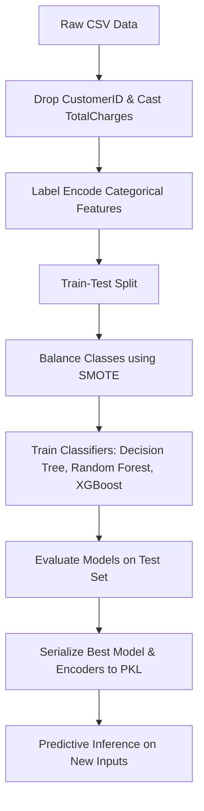

# Telco Customer Churn Prediction using Machine Learning

[](https://www.python.org/)
[](https://scikit-learn.org/)
[](LICENSE)

An end-to-end machine learning pipeline to predict customer churn using the Telco Customer Churn dataset. It addresses class imbalance using SMOTE and implements multiple classifiers (Decision Tree, Random Forest, and XGBoost) to find the best model. The final model is serialized and deployed within a custom real-time inference loop.

---

## Table of Contents
1. [Project Overview](#project-overview)
2. [Dataset Information](#dataset-information)
3. [Project Pipeline](#project-pipeline)
4. [Model Training and Evaluation Details](#model-training-and-evaluation-details)
5. [Installation and Setup](#installation-and-setup)
6. [Model Performance](#model-performance)
7. [Usage and Inference](#usage-and-inference)
8. [Future Roadmap](#future-roadmap)

---

## Project Overview
Customer churn occurs when customers stop doing business with a company. For telecom providers, identifying high-risk customers before they leave is critical to reducing retention costs and maintaining revenue stability.

This project outlines a complete machine learning workflow:
* Exploratory Data Analysis (EDA) to understand churn patterns.
* Preprocessing categorical variables via Label Encoding and handling data type formatting.
* SMOTE (Synthetic Minority Over-sampling Technique) to resolve the dataset's class imbalance.
* Model Training and Benchmarking using Decision Trees, Random Forest, and XGBoost.
* Serialization and Predictive Inference to classify churn risk for new customers.

---

## Dataset Information
The dataset used is `WA_Fn-UseC_-Telco-Customer-Churn.csv` containing 7,043 rows and 21 features.

### Key Features
* Demographics: `gender`, `SeniorCitizen`, `Partner`, `Dependents`
* Services Signed Up For: `PhoneService`, `MultipleLines`, `InternetService`, `OnlineSecurity`, `OnlineBackup`, `DeviceProtection`, `TechSupport`, `StreamingTV`, `StreamingMovies`
* Account Info: `tenure`, `Contract`, `PaperlessBilling`, `PaymentMethod`, `MonthlyCharges`, `TotalCharges`
* Target Variable: `Churn` (Yes/No - indicating if the customer left within the last month)

---

## Project Pipeline



---

## Model Training and Evaluation Details

### 1. Data Split
The preprocessed dataset is split into training and testing sets with an 80:20 ratio using a random state of 42 to ensure reproducibility:
* Training Set: 5,634 samples
* Testing Set: 1,409 samples

### 2. Handling Class Imbalance (SMOTE)
The target class `Churn` is highly imbalanced in the training set (4,138 "No Churn" vs. 1,496 "Churn" samples). To prevent model bias, SMOTE (Synthetic Minority Over-sampling Technique) with a random state of 42 was applied to the training set:
* Pre-SMOTE Training Labels: 0: 4,138 | 1: 1,496
* Post-SMOTE Training Labels: 0: 4,138 | 1: 4,138 (perfectly balanced at 8,276 samples)

### 3. Classifiers Benchmarked
Three classification algorithms were trained and compared using their default parameters:
* Decision Tree Classifier (random state 42)
* Random Forest Classifier (random state 42)
* XGBoost Classifier (random state 42)

### 4. Cross-Validation Results
Each model was evaluated using 5-Fold Cross-Validation on the balanced SMOTE training set to measure mean validation accuracy:
* Decision Tree: 78% mean accuracy (individual fold scores: 0.68, 0.71, 0.82, 0.85, 0.84)
* Random Forest: 84% mean accuracy (individual fold scores: 0.73, 0.77, 0.90, 0.90, 0.90)
* XGBoost: 83% mean accuracy (individual fold scores: 0.71, 0.75, 0.90, 0.89, 0.90)

### 5. Final Model Selection and Overfitting Notes
The Random Forest Classifier was selected as the final model because it achieved the highest cross-validation score (84%). 

However, when evaluated on the unseen test set (which was not oversampled with SMOTE), the Random Forest model achieved an accuracy of ~77.7%. This drop from 84% to 77.7% indicates overfitting to the synthetic samples created by SMOTE. Addressing this overfitting through hyperparameter tuning (e.g., limiting tree depth) is prioritized in the future roadmap.

---

## Installation and Setup

1. Clone the repository:
   ```bash
   git clone https://github.com/your-username/customer-churn-prediction.git
   cd customer-churn-prediction
   ```

2. Install required dependencies:
   ```bash
   pip install numpy pandas matplotlib seaborn scikit-learn imbalanced-learn xgboost
   ```

3. Run the notebook:
   Open `Customer_Churn_Prediction_using_ML.ipynb` in Jupyter Notebook, VS Code, or Google Colab and run all cells sequentially.

---

## Model Performance
After balancing the training set using SMOTE, models were trained and tested on the unseen split:

| Model | Evaluation Metric | Value |
| :--- | :--- | :--- |
| Random Forest | Accuracy | ~77.7% |
| Random Forest | Precision (Churn) | 0.58 |
| Random Forest | Recall (Churn) | 0.57 |
| Random Forest | F1-Score (Churn) | 0.58 |

### Confusion Matrix (Random Forest)
* True Negatives (No Churn): 882
* False Positives: 154
* False Negatives: 160
* True Positives (Churn): 213

---

## Usage and Inference
The final trained Random Forest Classifier model is saved to `customer_churn_model.pkl` along with `encoders.pkl`. You can load these files to predict churn on any single customer profile as follows:

```python
import pandas as pd
import pickle

# 1. Load the model and label encoders
with open("customer_churn_model.pkl", "rb") as f:
    model_data = pickle.load(f)
loaded_model = model_data["model"]
feature_names = model_data["features_names"]

with open("encoders.pkl", "rb") as f:
    encoders = pickle.load(f)

# 2. Define custom customer data (matching the features used)
new_customer = {
    'gender': 'Female',
    'SeniorCitizen': 0,
    'Partner': 'Yes',
    'Dependents': 'No',
    'tenure': 1,
    'PhoneService': 'No',
    'MultipleLines': 'No phone service',
    'InternetService': 'DSL',
    'OnlineSecurity': 'No',
    'OnlineBackup': 'Yes',
    'DeviceProtection': 'No',
    'TechSupport': 'No',
    'StreamingTV': 'No',
    'StreamingMovies': 'No',
    'Contract': 'Month-to-month',
    'PaperlessBilling': 'Yes',
    'PaymentMethod': 'Electronic check',
    'MonthlyCharges': 29.85,
    'TotalCharges': 29.85
}

new_customer_df = pd.DataFrame([new_customer])

# 3. Preprocess and encode categorical columns
for col, encoder in encoders.items():
    new_customer_df[col] = encoder.transform(new_customer_df[col])

# 4. Predict
prediction = loaded_model.predict(new_customer_df)
probability = loaded_model.predict_proba(new_customer_df)

print(f"Prediction: {'Churn' if prediction[0] == 1 else 'No Churn'}")
print(f"Confidence: {probability[0][prediction[0]] * 100:.2f}%")
```

---

## Future Roadmap
- [ ] Implement hyperparameter tuning (e.g., GridSearch / RandomSearch) to optimize performance.
- [ ] Address overfitting by tuning tree depth and min-sample splits.
- [ ] Test downsampling techniques as an alternative to SMOTE.
- [ ] Incorporate Stratified K-Fold Cross Validation for robust evaluation.
- [ ] Build a lightweight Streamlit/Gradio web application for the interactive prediction system.
